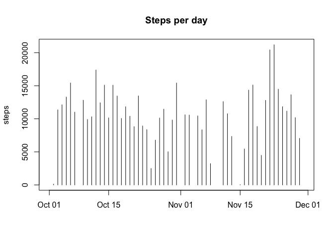
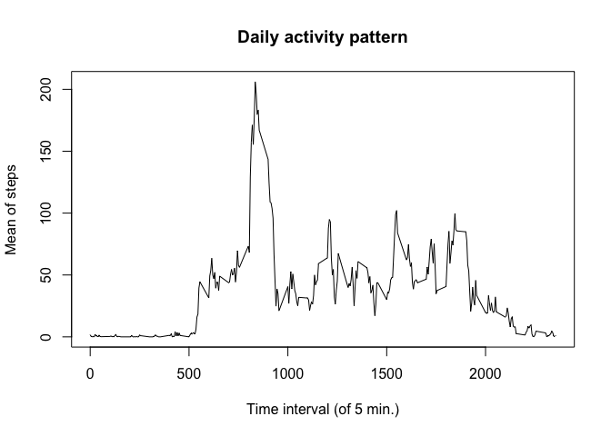
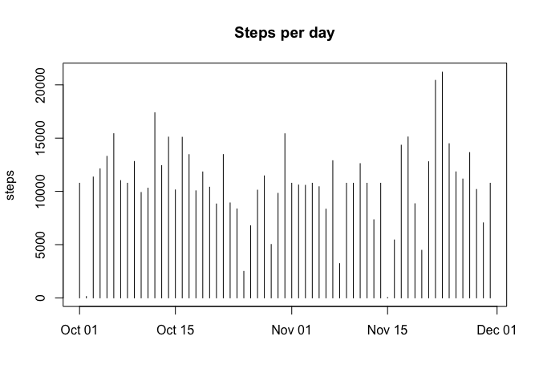
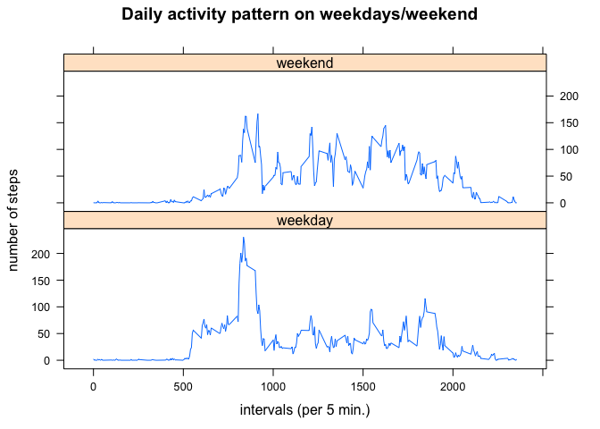

# Reproducible Research: Peer Assessment 1


## Loading and preprocessing the data
1. Load the data.

```r
data <- read.csv("activity.csv")
```
2. Process/transform the data into a forma suitable for analysis.

```r
data$date <- as.Date(data$date, "%Y-%m-%d")
```

## What is mean total number of steps taken per day?
1. Calculate the total number of steps taken per day.

```r
steps_day <- setNames(aggregate(data$steps, list(data$date), sum), c("date", "steps"))
```

2. Histogram of the total number of steps taken each day.

```r
plot(steps_day$date, steps_day$steps, main = "Steps per day", xlab = "", ylab = "steps", type = "h")
```

\

3. Calculate and report the mean and median of the total number of steps taken per day.

```r
steps_day_mean <- setNames(aggregate(data$steps, list(data$date), mean), c("date", "mean"))
steps_day_median <- setNames(aggregate(data$steps, list(data$date), median), c("date", "median"))
steps_day_mean_median <- setNames(data.frame(steps_day_mean$date, steps_day_mean$mean, steps_day_median$median), c("date", "mean", "median"))
```

```
##          date       mean median
## 1  2012-10-01         NA     NA
## 2  2012-10-02  0.4375000      0
## 3  2012-10-03 39.4166667      0
## 4  2012-10-04 42.0694444      0
## 5  2012-10-05 46.1597222      0
## 6  2012-10-06 53.5416667      0
## 7  2012-10-07 38.2465278      0
## 8  2012-10-08         NA     NA
## 9  2012-10-09 44.4826389      0
## 10 2012-10-10 34.3750000      0
## 11 2012-10-11 35.7777778      0
## 12 2012-10-12 60.3541667      0
## 13 2012-10-13 43.1458333      0
## 14 2012-10-14 52.4236111      0
## 15 2012-10-15 35.2048611      0
## 16 2012-10-16 52.3750000      0
## 17 2012-10-17 46.7083333      0
## 18 2012-10-18 34.9166667      0
## 19 2012-10-19 41.0729167      0
## 20 2012-10-20 36.0937500      0
## 21 2012-10-21 30.6284722      0
## 22 2012-10-22 46.7361111      0
## 23 2012-10-23 30.9652778      0
## 24 2012-10-24 29.0104167      0
## 25 2012-10-25  8.6527778      0
## 26 2012-10-26 23.5347222      0
## 27 2012-10-27 35.1354167      0
## 28 2012-10-28 39.7847222      0
## 29 2012-10-29 17.4236111      0
## 30 2012-10-30 34.0937500      0
## 31 2012-10-31 53.5208333      0
## 32 2012-11-01         NA     NA
## 33 2012-11-02 36.8055556      0
## 34 2012-11-03 36.7048611      0
## 35 2012-11-04         NA     NA
## 36 2012-11-05 36.2465278      0
## 37 2012-11-06 28.9375000      0
## 38 2012-11-07 44.7326389      0
## 39 2012-11-08 11.1770833      0
## 40 2012-11-09         NA     NA
## 41 2012-11-10         NA     NA
## 42 2012-11-11 43.7777778      0
## 43 2012-11-12 37.3784722      0
## 44 2012-11-13 25.4722222      0
## 45 2012-11-14         NA     NA
## 46 2012-11-15  0.1423611      0
## 47 2012-11-16 18.8923611      0
## 48 2012-11-17 49.7881944      0
## 49 2012-11-18 52.4652778      0
## 50 2012-11-19 30.6979167      0
## 51 2012-11-20 15.5277778      0
## 52 2012-11-21 44.3993056      0
## 53 2012-11-22 70.9270833      0
## 54 2012-11-23 73.5902778      0
## 55 2012-11-24 50.2708333      0
## 56 2012-11-25 41.0902778      0
## 57 2012-11-26 38.7569444      0
## 58 2012-11-27 47.3819444      0
## 59 2012-11-28 35.3576389      0
## 60 2012-11-29 24.4687500      0
## 61 2012-11-30         NA     NA
```

## What is the average daily activity pattern?
1. Make a time series plot of the 5-minute interval (x-axis) and the average number of steps taken, averaged across all day (y-axis).

```r
steps_interval_mean <- setNames(aggregate(data$steps, list(data$interval), mean, na.rm = TRUE), c("interval", "mean"))
plot(steps_interval_mean$interval, steps_interval_mean$mean, type = "l", xlab = "Time interval (of 5 min.)", ylab = "Mean of steps", main = "Daily activity pattern")
```

\
2. The 5-minute interval, on average accross all the day that contains the maximum number of steps is

```r
steps_interval_mean_max <- steps_interval_mean[which.max(steps_interval_mean$mean),]
```

```
##     interval     mean
## 104      835 206.1698
```

## Imputing missing values
1. Calculate and report the total number of missing values in the dataset.

```r
na_steps <- sum(is.na(data$steps))
```

```
## [1] 2304
```

2. Fill in missing values with the mean of the 5-minute interval.

```r
data_f <- merge(data, steps_interval_mean, by = "interval")
data_f <- data_f[order(data_f$date, data_f$interval),]
data_f$steps <- apply(data_f, 1, function(x) if (is.na(x[2])) { x[4] } else { x[2] })
data_f$steps <- as.numeric(data_f$steps)
```
3. Create new dataset equal to original one but with missing data filled in.

```r
data_f <- setNames(data.frame(data_f$steps, data_f$date, data_f$interval), c("steps", "date", "interval"))
```

4. Make a histogram of the total number of steps taken each day and calculate and report the mean and median
total number of steps taken per day.

```r
steps_day_f <- setNames(aggregate(data_f$steps, list(data_f$date), sum), c("date", "steps"))
plot(steps_day_f$date, steps_day_f$steps, main = "Steps per day", xlab = "", ylab = "steps", type = "h")
```

\

```r
steps_day_mean_f <- setNames(aggregate(data_f$steps, list(data_f$date), mean), c("date", "mean"))
steps_day_median_f <- setNames(aggregate(data_f$steps, list(data_f$date), median), c("date", "median"))
steps_day_mean_median_f <- setNames(data.frame(steps_day_mean_f$date, steps_day_mean_f$mean, steps_day_median_f$median), c("date", "mean", "median"))
```

```
##          date       mean   median
## 1  2012-10-01 37.3825996 34.11321
## 2  2012-10-02  0.4375000  0.00000
## 3  2012-10-03 39.4166667  0.00000
## 4  2012-10-04 42.0694444  0.00000
## 5  2012-10-05 46.1597222  0.00000
## 6  2012-10-06 53.5416667  0.00000
## 7  2012-10-07 38.2465278  0.00000
## 8  2012-10-08 37.3825996 34.11321
## 9  2012-10-09 44.4826389  0.00000
## 10 2012-10-10 34.3750000  0.00000
## 11 2012-10-11 35.7777778  0.00000
## 12 2012-10-12 60.3541667  0.00000
## 13 2012-10-13 43.1458333  0.00000
## 14 2012-10-14 52.4236111  0.00000
## 15 2012-10-15 35.2048611  0.00000
## 16 2012-10-16 52.3750000  0.00000
## 17 2012-10-17 46.7083333  0.00000
## 18 2012-10-18 34.9166667  0.00000
## 19 2012-10-19 41.0729167  0.00000
## 20 2012-10-20 36.0937500  0.00000
## 21 2012-10-21 30.6284722  0.00000
## 22 2012-10-22 46.7361111  0.00000
## 23 2012-10-23 30.9652778  0.00000
## 24 2012-10-24 29.0104167  0.00000
## 25 2012-10-25  8.6527778  0.00000
## 26 2012-10-26 23.5347222  0.00000
## 27 2012-10-27 35.1354167  0.00000
## 28 2012-10-28 39.7847222  0.00000
## 29 2012-10-29 17.4236111  0.00000
## 30 2012-10-30 34.0937500  0.00000
## 31 2012-10-31 53.5208333  0.00000
## 32 2012-11-01 37.3825996 34.11321
## 33 2012-11-02 36.8055556  0.00000
## 34 2012-11-03 36.7048611  0.00000
## 35 2012-11-04 37.3825996 34.11321
## 36 2012-11-05 36.2465278  0.00000
## 37 2012-11-06 28.9375000  0.00000
## 38 2012-11-07 44.7326389  0.00000
## 39 2012-11-08 11.1770833  0.00000
## 40 2012-11-09 37.3825996 34.11321
## 41 2012-11-10 37.3825996 34.11321
## 42 2012-11-11 43.7777778  0.00000
## 43 2012-11-12 37.3784722  0.00000
## 44 2012-11-13 25.4722222  0.00000
## 45 2012-11-14 37.3825996 34.11321
## 46 2012-11-15  0.1423611  0.00000
## 47 2012-11-16 18.8923611  0.00000
## 48 2012-11-17 49.7881944  0.00000
## 49 2012-11-18 52.4652778  0.00000
## 50 2012-11-19 30.6979167  0.00000
## 51 2012-11-20 15.5277778  0.00000
## 52 2012-11-21 44.3993056  0.00000
## 53 2012-11-22 70.9270833  0.00000
## 54 2012-11-23 73.5902778  0.00000
## 55 2012-11-24 50.2708333  0.00000
## 56 2012-11-25 41.0902778  0.00000
## 57 2012-11-26 38.7569444  0.00000
## 58 2012-11-27 47.3819444  0.00000
## 59 2012-11-28 35.3576389  0.00000
## 60 2012-11-29 24.4687500  0.00000
## 61 2012-11-30 37.3825996 34.11321
```
The values differ slightly from the first part of the assignment but the overall pattern remains the same.

## Are there differences in activity patterns between weekdays and weekends?
1. Create a new factor variable in the dataset with two levels-"weekday" and "weekend".

```r
data_f$date <- as.Date(data_f$date)
data_f$day_type <- weekdays(data_f$date)
data_f$day_type <- apply(data_f, 1, function(x) if (x[4] == "Saturday" | x[4] == "Sunday") { "weekend" } else { "weekday" })
```

2. Make a panel plot containing a time series plot of the 5-minute interval (x-axis) and the average 
number of steps taken, averaged across all weekday days or weekend days (y-axis).Make sure that the lattice library is installed.

```r
library(lattice)
steps_interval_day_type_f <- aggregate(steps ~ interval + day_type, data_f, mean)  
xyplot(steps_interval_day_type_f$steps ~ steps_interval_day_type_f$interval | steps_interval_day_type_f$day_type, type = "l", main = "Daily activity pattern on weekdays/weekend", xlab = "intervals (per 5 min.)", ylab = "number of steps", layout = c(1, 2))
```

\
